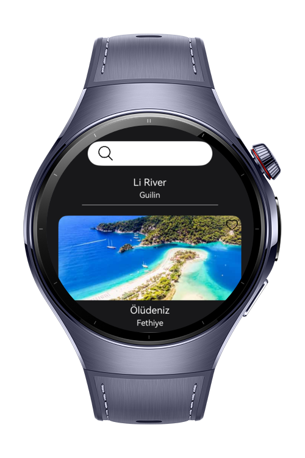
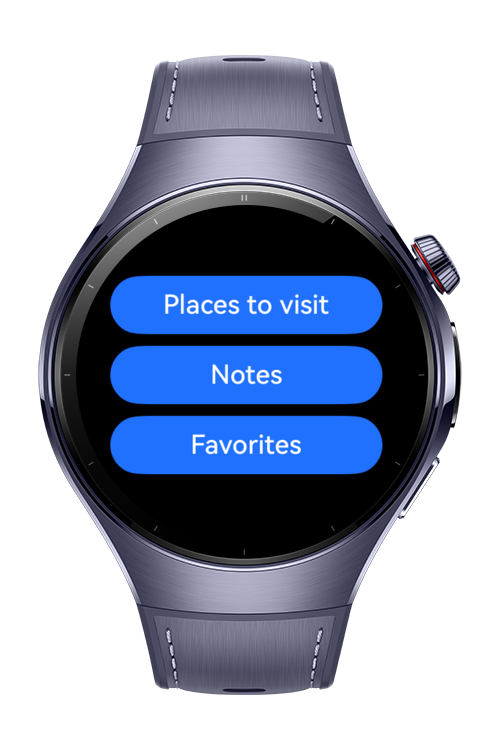

> **Note:** To access all shared projects, get information about environment setup, and view other guides, please visit 

# Touristic Places Application

This project demonstrates a touristic places for inspiring the trip plan. This app can be used for fast planning.

# Preview

<div>
   
   
   
   
</div>

# Use Cases
It is a tourism app for users who want to travel and take notes. The buttons do not have any functions. This project is an UI project.

1) The user can see the places to visit. The places data is dummy data.
2) The user can search the places. This function works well.
3) The user can add, edit, delete notes. (no function)
4) The user add the places to the favorites list. (no function)
5) The user can see the places list.

# Tech Stack

- **Languages**: ArkTS
- **Frameworks**: HarmonyOS SDK 5.0.2(14)
- **Tools**: DevEco Studio Vers 5.1.0.240SP1
- **Libraries**: @kit.ArkUI

# Directory Structure
   ```
entry/src/main/ets/
|---components
|---|---AnimatedText
|---|---FavoriteCard
|---|---NotesListComponent
|---|---PlacesCardComponent
|---|---SearchBar
|---model
|---|---Favorites
|---|---NotesModel
|---|---PlacesModel
|---pages
|---|---AddNotePage
|---|---FavoritesPage
|---|---HomePage
|---|---NotesPage
|---|---PlacesPage
|---|---SplashPage
|---viewmodel
|---|---FavoritesViewModel
|---|---NotesViewModel
|---|---PlacesViewModel
|---entryability
|---|---EntryAbility
|---entrybackupability
|---|---EntryBackupAbility
   ```
# Constraints and Restrictions
## Supported Devices
 - Huawei Watch 5
# License
Touristic Places Application is distributed under the terms of the MIT License
See the [LICENSE](./LICENSE) for more information.
